`# FitME-gRPC

Rewrite of the FitME REST version to a gRPC infrastructure with a strong emphasis on middleware, tracing, and logging integration.
By sharing proto definitions and containerizing services, this project achieves flexible inter-service communication while ensuring proper context propagation, error handling, and telemetry across the stack.

## Overview
FitME-gRPC is a rewrite of the original FitME REST API into a gRPC-based service architecture. The project is built with a strong emphasis on robust middleware management, comprehensive tracing and logging, and seamless integration with modern observability tools (Prometheus, Grafana, Loki, Tempo). It aims to improve scalability and maintainability while providing enhanced telemetry and debugging capabilities.

## Architecture & Technology Stack

- Backend:
1. Language: Go (Golang)
2. Communication: gRPC with shared proto definitions
3. Middleware: Custom middleware layers wrapping OpenTelemetry for tracing, logging, and metrics
4. Database: PostgreSQL
5. Caching: Redis

- Telemetry:
1. Tracing: Stdout, Jaeger, Zipkin, Datadog, and OTLP collector
2. Metrics: Prometheus, Datadog, and OTLP collector
3. Logs: OTLP collector (integrated with Loki)
4. Containerization: Docker (with Kubernetes deployment for production)

- Other Tools:
1. PDF builder: Maroto
2. CSV/Excel builder: (see Domonda for inspiration)

## Core Features
- gRPC Infrastructure:
Fully containerized and using gRPC for high-performance communication between services.

- Middleware Management:
Ensures proper ordering for context propagation, panic handling, logging, and metrics collection. Uses wrappers around OpenTelemetry middleware to guard against breaking changes.

- Observability:
Integrated with multiple telemetry backends including Prometheus, Grafana, Loki, Tempo, and Jaeger.

- Data Exporters:
Support for PostgreSQL, Redis exporters, and integration with message systems for notifications (e.g., Kafka).

## Telemetry
### Traces
- Exporters:
Stdout
Jaeger
Zipkin
Datadog
OpenTelemetry (OTLP) Collector
- Importers:
OpenTracingShim

### Metrics
- Exporters:
Prometheus
Datadog
OpenTelemetry (OTLP) Collector
- Importers:
SwiftMetricsShim
Logs
Exporters:
OpenTelemetry (OTLP) Collector
(Integrated with Loki for log aggregation)

## Service Integration
- Proto Sharing:
A shared proto directory is used for service communication across the architecture.
- Containerized Services:
Docker Compose is used for local testing, while Kubernetes is used in production for scalability and high availability.
- Middleware Pipeline:
Middleware ensures correct ordering of interceptors for tracing, logging, and metrics (e.g., Prometheus and OTEL interceptors).

## Deployment & Kubernetes
Local Testing:

- Tempo:

```kubectl port-forward svc/tempo 4317 -n monitoring```
- Grafana:
```kubectl port-forward svc/grafana 3000:80 -n monitoring```
Prometheus:
```kubectl port-forward prometheus-prometheus-kube-prometheus-prometheus-0 9090 -n monitoring```
Production Deployment:
- All telemetry services (Prometheus, Grafana, Loki, Tempo, etc.) are deployed on Kubernetes.
- Ingress configuration should be updated in production to point to the proper Grafana/Prometheus endpoints.

### Additional Features
- Leaderboard Feature
Concept:
Open the user platform to allow regular users to see progress, plans, and achievements.
- Privacy:
Consider anonymizing data and providing customizable, public or private leaderboards.
- Customization:
Allow users to define goals (absolute, relative, custom) and compare progress with friends or community members.

## FitSynch
FitSynch expands the FitME concept by integrating personal training management with AI-powered meal planning and shopping assistance.
Key Components:

- User Management for Trainers:
Manage clients, assign workout/meal plans, and communicate via messaging.
- Workout & Meal Plans:
Create personalized workout plans with video tutorials and customizable meal plans with macro breakdowns.
- Ingredients, Recipes, and Shopping List Generator:
Build a database of nutritional data, share recipes, and automatically generate shopping lists.
- AI-Powered Assistance:
1. Meal Plan AI: Suggest meals based on preferences and dietary restrictions.
2. Shopping AI: Provide calorie breakdowns, healthier alternatives, and cost-saving suggestions.
3. Fitness Insights: Analyze user progress and recommend workout adjustments.
- Trainer Dashboard:
A centralized dashboard for trainers to manage clients, view progress, and handle payments.

### Mental Health & Stress Management
Handling workouts, diet, and tracking, adding mental health tools would create a comprehensive health & wellness platform.

- Guided Meditation & Breathing Exercises

1. Integrate AI-powered meditation sessions (e.g., suggest sessions based on user stress levels).
2. Use HRV (Heart Rate Variability) analysis (if they wear a smartwatch) to detect stress.
3. Personalized daily mood check-ins → AI suggests stress-relief activities.

- Cognitive Behavioral Therapy (CBT) Tools

1. AI-based journaling assistant (users log thoughts, AI suggests coping strategies).
2. Daily affirmations & gratitude journaling with AI insights.
3. Chatbot for low-level mental health support (before professional intervention).

- Sleep Tracking & Optimization

1. Sync with wearables (Oura, Fitbit, Apple Watch, Whoop) to track sleep cycles.
2. AI suggests optimal sleep schedule & bedtime routines.
3. Integration with blue light blocking & relaxation sounds before sleep.

- AI-powered Stress & Recovery Score

1. Uses HRV, workouts, diet, and sleep to generate a daily wellness score.
2. Suggests "rest vs. workout" days dynamically based on recovery.
3. Tells trainers if a client is overtraining or needs recovery.

### AI-Powered Healthcare Insights
With our own AI model, each user can have a personal AI health assistant.

- AI predicts injuries & burnout risk from past workout data.
- AI detects signs of depression based on user activity, journaling & HRV.
- AI analyzes blood test results (users upload results, AI explains trends).
- AI suggests supplements based on diet gaps & training intensity.

### Social & Gamification
- Health & Wellness Challenges
1. Weekly steps, water intake, meal tracking challenges.
2. Leaderboards with anonymous & public ranking options.
3. Rewards like discounts, free sessions, or in-app currency.

-Community & Social Features
1. Trainer-led groups for clients (chat, workouts, accountability).
2. Workout buddies & accountability partners matching.
3. Integration with social media for sharing progress (optional).

### Hybrid Web & Mobile Strategy
TODO web platform?
- YES if want to expand into nutritionists, therapists, doctors, and more trainers.
- NO if keep it strictly fitness-focused, since most users will engage via mobile.

## How to split features across platforms?
### Web for Trainers & Healthcare Providers

- Dashboard for tracking client progress.
- Scheduling & video calls.
- Billing & subscription management.

### Web for Advanced Users (if included)
- Meal planning (drag & drop UI).
- Workout plan customization.
- In-depth analytics & reports.

### Mobile for General Users

- AI-powered daily guidance & tracking.
- Quick workout & meal logging.
- Gamification, social feed & challenges.

### Health Data Integrations
Since dealing with fitness + health, deeper biometric tracking would be a killer feature.

- Apple Health, Google Fit, Strava → for workout tracking.
- Oura, Whoop, Fitbit → for HRV & recovery insights.
- Blood test API integration (e.g., InsideTracker) → AI analyzes health markers.

### Advanced Features for Trainers & Gyms
- Auto-Generated Workout Plans & Adjustments
1. AI analyzes user progress, soreness, and energy levels.
2. Auto-adjusts workout intensity based on recovery.
3. "AI spotter" alerts if weight selection seems off.

- Nutritional AI Assistant for Coaches
1. AI auto-suggests meal plans based on client's goals & eating habits.
2. AI flags possible deficiencies (e.g., lack of protein or iron).
3. Auto-generates shopping lists based on meal plans.

- Gyms & Trainers Marketplace
1. Trainers can list services & packages.
2. Users can book sessions directly.
3. AI matches trainers to clients based on goals & experience.

### Meal Plan Validation
- Purpose:
Ensure that a meal plan aligns with the user's objective (e.g., maintenance mode should not exceed a specific calorie goal).
- Guidance:
Warn users if their meal plan exceeds their objective's calorie goal, allowing for adjustments or confirmations.
- Flexibility:
Optionally allow overrides while logging such events for further review.

### Access Telemetry UIs:

Grafana: http://localhost:3000
Jaeger: http://localhost:16686
Prometheus: http://localhost:9090
Loki: Use the mapped port (e.g., http://localhost:3100 for API requests)
Kubernetes (Production):
Follow the Kubernetes deployment manifests and use port-forwarding as outlined in the Deployment & Kubernetes section for accessing services locally.

Contributing
Contributions are welcome! Please fork the repository, create your feature branch, and submit a pull request. Ensure that your changes are covered by appropriate tests and documentation updates.

# High-Level Technical Requirements
## API/Backend Services

Go with gRPC. Organize your services by domain—e.g.:
1. UserService (handles sign‐up, login, user profiles, roles, friend requests, etc.)
2. MessagingService (handles chat, file sharing, or you can split file sharing out)
3. NotificationsService (handles push/email notifications, in‐app notifications)
4. WorkoutService (exercise sessions, workout plans)
5. DietService (meal plans, ingredients, logs)
6. TrainerService / GymService (manages trainer–client relationships, gym data, classes, etc.)
7. Each service exposes gRPC endpoints.
8. Real-Time Communications (Chat & Video Calls)

## Chat:
Implement chat over gRPC streams (bidirectional streaming) or use WebSockets.
Store conversations/messages in PostgreSQL (or a NoSQL store).
## Video Calls:
Typically done with a signaling server that sets up a WebRTC or other real-time protocol.
Do signaling over gRPC streams or a separate WebSocket.
Actual video/voice runs peer-to-peer (or via SFU/MCU if group calls).

## Notifications
You will want an internal mechanism (e.g., a small pub/sub or events) to generate notifications for “new message,” “new plan,” “friend request,” etc.
Store them in a notifications table, with a “read/unread” flag.
Send push/email/SMS via third-party providers (SendGrid, Twilio, etc.).

## File Sharing
Typically store actual files in an object store (S3, GCS, etc.).
In DB, store only references/URLs and metadata (filename, size, content type, etc.).
Integrations for:

## Email invites (SendGrid/Mailgun/SES).
SMS invites (Twilio, etc.).
Social media (Facebook/Twitter/Instagram/TikTok) if you want to share a link to invite.
Live streaming to Instagram/TikTok typically requires those platforms’ official APIs. Usually you’d generate an RTMP URL/stream key from the social platform, then push your video feed to it.
Leaderboards & Achievements

## Keep track of user points in a table (e.g. user_points).
A separate table for achievements (e.g. achievements + user_achievements).
Personal Trainer & Gym Entities

# TODO / Future Work

[x] Fix Prometheus integration
[x]Configure Loki integration
[x]Configure Tempo integration
[x]Complete Grafana configuration for production (configure ingress and point to Prometheus)
[x]Kubernetes deployment for all services
[x]Finalize PostgreSQL and Redis exporters
[]Finalize all remaining services
[]Implement a messaging system for communication between personal trainers (PTs) and clients
[]Integrate Kafka (or similar) for message queue and notifications
[]Add PDF builder (using Maroto)
[]Add CSV and Excel builders (see Domonda for reference)
[]Further enhance security, data privacy, and RBAC
[]Finalize the leaderboard feature and FitSynch enhancements

## Additional Microservices

### 1. BiometricsService
```protobuf
service BiometricsService {
  rpc TrackHRV(HRVData) returns (BiometricResponse);
  rpc SyncWearableData(stream WearableData) returns (SyncResponse);
  rpc GetStressScore(UserID) returns (StressScore);
  rpc GetRecoveryMetrics(UserID) returns (RecoveryMetrics);
  rpc StreamRealtimeMetrics(UserID) returns (stream BiometricStream);
}
```

- Handles all wearable device integrations
- Processes HRV, sleep, and recovery data
- Implements device-specific adapters for Apple Health, Google Fit, Oura, etc.
- Uses Redis for real-time metric caching

### 2. MentalHealthService
```protobuf
service MentalHealthService {
  rpc LogMoodEntry(MoodData) returns (MoodResponse);
  rpc GetMoodTrends(UserID) returns (MoodTrends);
  rpc StartMeditationSession(MeditationConfig) returns (stream GuidanceAudio);
  rpc ProcessJournalEntry(JournalData) returns (AIInsights);
  rpc GetWellnessScore(UserID) returns (WellnessMetrics);
}
```

- Implements secure journaling with encryption
- Handles meditation session management
- Processes mood tracking and analysis
- Integrates with AI for personalized insights

### 3. AIOrchestrationService
```protobuf
service AIOrchestrationService {
  rpc GetPersonalizedRecommendations(UserContext) returns (Recommendations);
  rpc AnalyzeWorkoutForm(stream VideoFrame) returns (FormAnalysis);
  rpc PredictBurnoutRisk(UserMetrics) returns (RiskAssessment);
  rpc GenerateMealPlan(DietaryPreferences) returns (MealPlan);
  rpc GetHealthInsights(HealthData) returns (HealthAnalysis);
}
```

- Coordinates all AI model interactions
- Manages model versioning and A/B testing
- Handles feature extraction and preprocessing
- Implements model serving infrastructure

## Data Storage Enhancements

1. Time Series Data

```sql
CREATE TABLE biometric_readings (
    user_id UUID,
    timestamp TIMESTAMPTZ,
    metric_type VARCHAR(50),
    value DOUBLE PRECISION,
    device_source VARCHAR(100),
    PRIMARY KEY (user_id, timestamp, metric_type)
);
```

- Use TimescaleDB extension for PostgreSQL
- Implement automatic data retention policies
- Set up continuous aggregates for trending

2. Event Streaming
```yaml
kafka:
  topics:
    - name: biometric-events
      partitions: 12
      replication: 3
    - name: mood-updates
      partitions: 6
      replication: 3
    - name: ai-predictions
      partitions: 8
      replication: 3
```

- Kafka for real-time event processing
- Implement event sourcing for critical data
- Set up stream processing for real-time analytics

## Security Enhancements

### 1. Health Data Compliance
```go
type HealthDataEncryption struct {
    KeyRotationInterval time.Duration
    EncryptionAlgorithm string
    KeyManagementService interface{}
}
```

- Implement HIPAA-compliant data storage
- Set up PHI (Protected Health Information) handling
- Implement data anonymization for research

### 2. Consent Management
```protobuf
service ConsentService {
  rpc UpdateDataSharingPreferences(SharingPreferences) returns (UpdateResponse);
  rpc GetUserConsents(UserID) returns (ConsentStatus);
  rpc RevokeConsent(ConsentRevocation) returns (RevocationResponse);
}
```
- Handle granular data sharing permissions
- Manage research participation consent
- Track data usage and access logs

## Integration Patterns

### 1. Device Integration
```go
type DeviceIntegration struct {
    Provider string
    AuthType AuthenticationMethod
    DataSync SyncStrategy
    RateLimits RateLimitConfig
}
```
- Implement OAuth2 for device connections
- Handle offline data syncing
- Manage rate limiting per provider

### 2. External API Integration
```yaml
integrations:
  - service: blood-test-api
    type: REST
    auth: oauth2
    rate_limit: 1000/hour
  - service: nutrition-database
    type: GraphQL
    auth: api_key
    rate_limit: 5000/hour
```

- Set up API gateways for external services
- Implement circuit breakers
- Handle quota management

## Observability Enhancements

### 1. Custom Metrics
```go
type WellnessMetrics struct {
    UserEngagement *prometheus.GaugeVec
    MentalHealthScores *prometheus.HistogramVec
    AIModelLatency *prometheus.SummaryVec
    DeviceSyncStatus *prometheus.GaugeVec
}
```
- Track wellness-specific metrics
- Monitor AI model performance
- Track integration health

### 2. Health Checks
```go
type HealthCheck struct {
    BiometricSync Status
    AIModelServing Status
    DataEncryption Status
    ExternalIntegrations map[string]Status
}
```
- Implement deep health checks
- Monitor data quality
- Track integration status

## Deployment Considerations

### 1. Multi-Region Setup
```yaml
regions:
  - name: us-east1
    primary: true
    services: all
  - name: eu-west1
    primary: false
    services: [user, biometric, mental-health]
```

- Handle data residency requirements
- Implement geo-specific features
- Manage multi-region sync

### 2. Scaling Strategy
```yaml
autoscaling:
  biometric_service:
    min_replicas: 3
    max_replicas: 10
    metrics:
      - type: cpu
        target: 70
  ai_service:
    min_replicas: 2
    max_replicas: 8
    metrics:
      - type: custom
        name: model_queue_length
        target: 100
```
- Set up service-specific scaling
- Implement predicative scaling
- Handle burst capacity

# Diagrams

### Architechture Overview

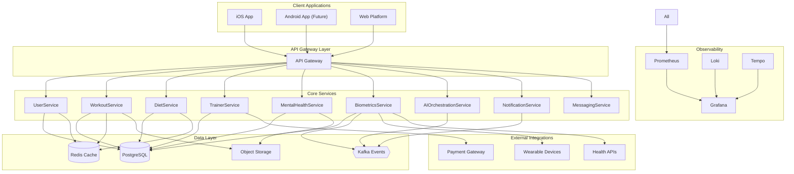

### Data flow and event processing
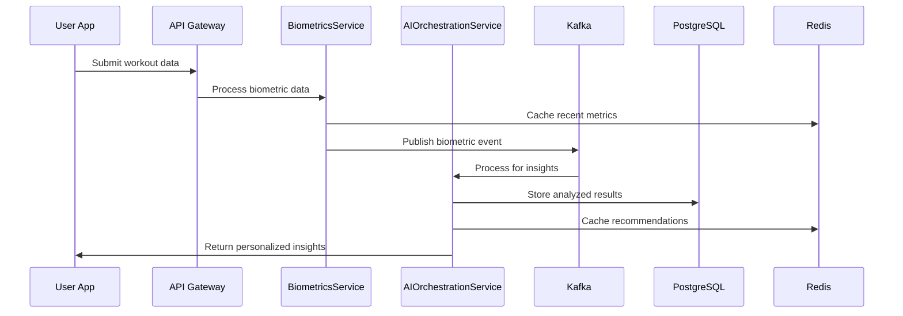

### CICD PIPELINE
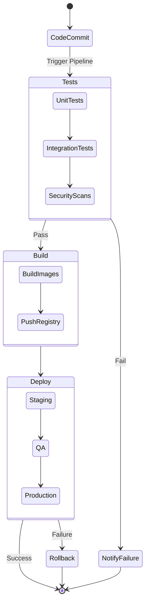

### Mental Health Service Flow
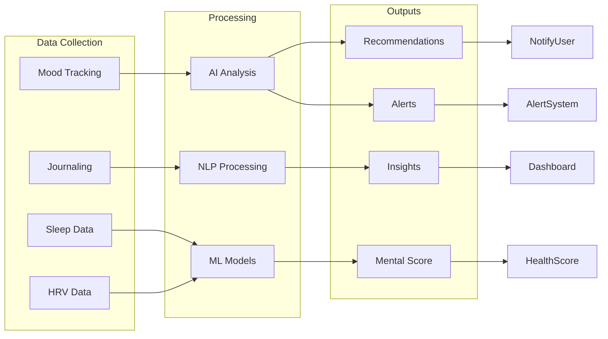
### Database Schema
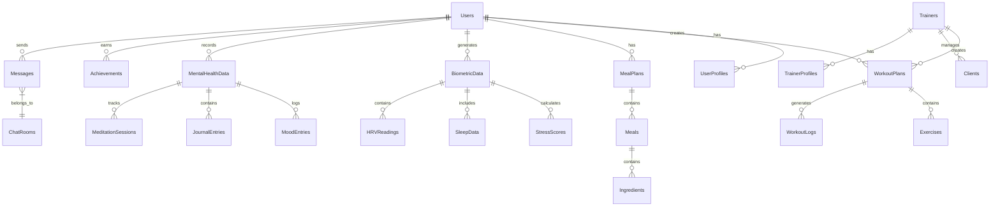

### Authorization / Authentication
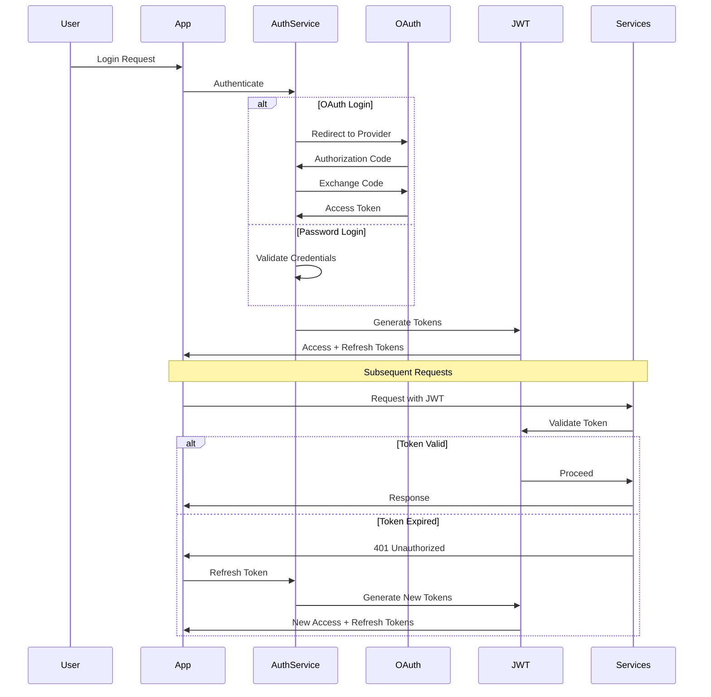

### AI MODEL Training Pipeline
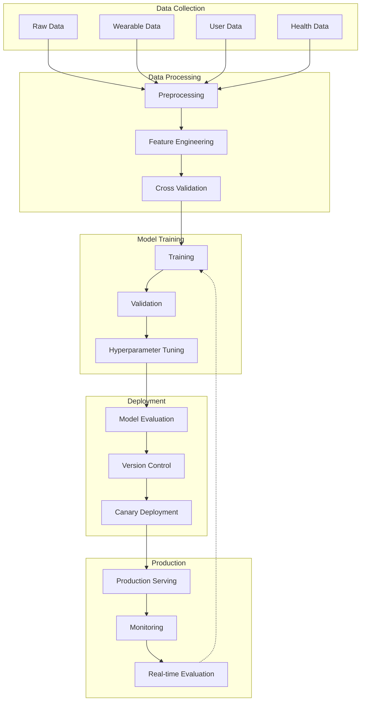


### System Architecture:
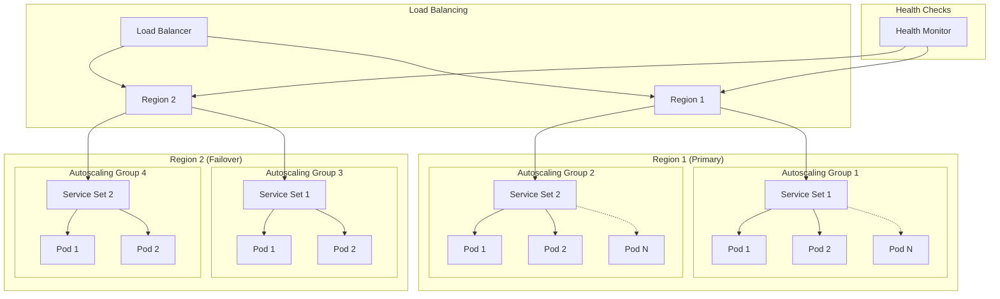
### Security Architechture
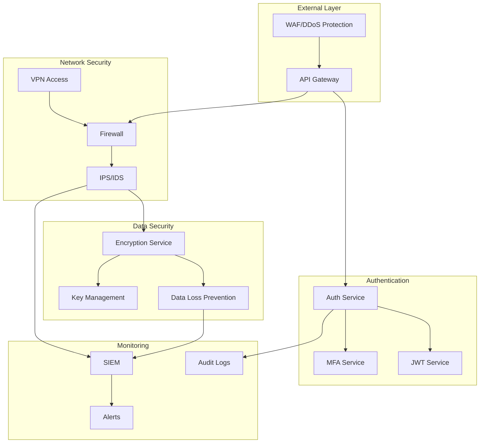

### HIMS&HERS Integration
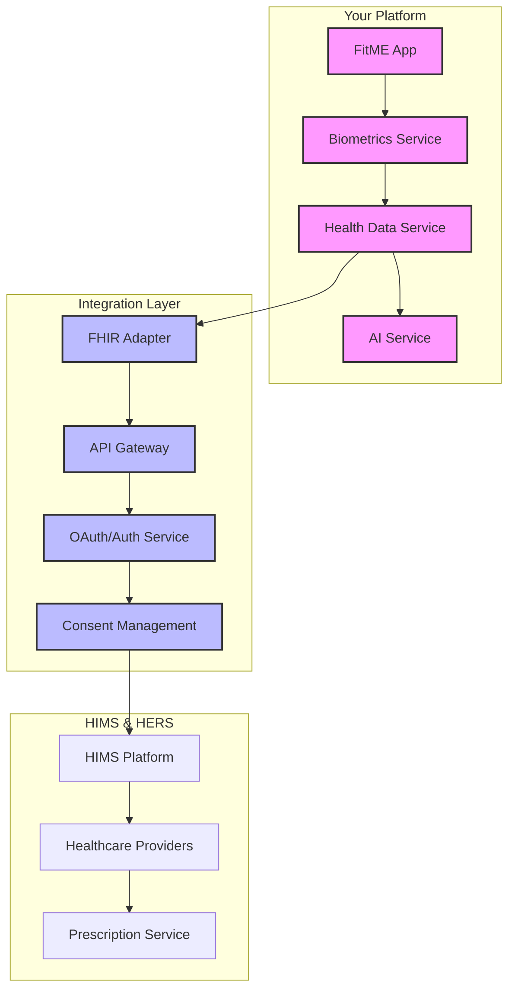

Shows all major components and their interactions
Includes both internal services and external integrations
Demonstrates the observability stack setup


### Data Flow:

Illustrates how data moves through the system
Shows the event processing pipeline
Demonstrates caching and storage strategies


### Deployment Pipeline:

Shows the CI/CD process
Includes testing and security checks
Demonstrates the staging and production deployment flow


### Mental Health Service Flow:

Shows how mental health data is collected and processed
Illustrates the AI/ML pipeline
Demonstrates the various outputs and interventions

### Database Schema:

Shows relationships between different entities
Illustrates data model hierarchy
Demonstrates connections between user, trainer, and health data


### Authentication Flow:

Shows both OAuth and password-based authentication
Illustrates token management
Demonstrates refresh flow


### AI Pipeline:

Shows data collection through deployment
Illustrates training and validation process
Demonstrates monitoring and feedback loop


### Scaling Strategy:

Shows multi-region deployment
Illustrates autoscaling groups
Demonstrates failover mechanisms


### Security Architecture:

Shows security layers
Illustrates data protection mechanisms
Demonstrates monitoring and alerting

### Him&Hers Integration:

- Integration Strategy:


HIMS & HERS focuses on telehealth and prescription services
Platform focuses on fitness, wellness, and biometric tracking
Complementary services, not competitive ones
Data could provide valuable health insights for their medical providers


- Technical Feasibility:


Building with healthcare data standards in mind
Architecture with gRPC services makes integration easier
Implementing proper security and HIPAA compliance
System is designed to handle health data properly


- Business Value for HIMS:


They get real-time health/fitness data for their patients
Better informed medical decisions
Enhanced patient monitoring
Competitive advantage over other telehealth platforms


- Business Value for You:


Access to legitimate healthcare providers
Enhanced credibility
Potential revenue sharing
Larger user base

## To prepare for this HIMS&HERS integration in the future

- Implement FHIR (Fast Healthcare Interoperability Resources) standards
- Build robust API documentation
- Ensure HIPAA compliance
- Create clean integration points

# Technical Integration Proposal: FitME & HIMS Partnership

## 1. Integration Specifications

### 1.1 Data Flow Architecture
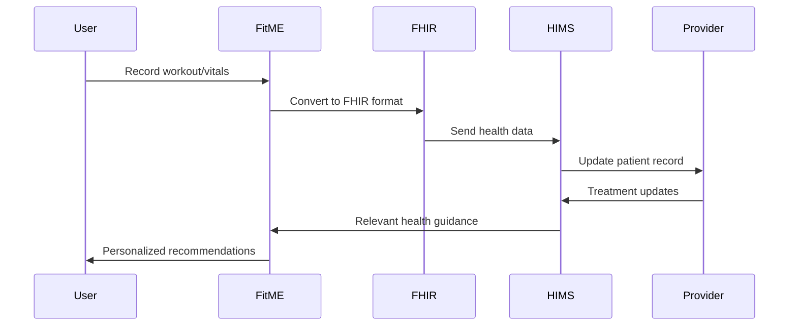

### 1.2 Integration Points

1. Authentication & Authorization
  - OAuth 2.0 with SMART on FHIR
  - Scoped access tokens
  - User consent management
  - Role-based access control

2. Data Synchronization
  - Real-time vital updates
  - Batch workout summaries
  - Periodic health assessments
  - Bi-directional alerts

3. Security Measures
  - End-to-end encryption
  - HIPAA-compliant storage
  - Audit logging
  - Data residency compliance

## 2. FHIR Resources Implementation

### 2.1 Core Resources

1. `Patient`
```json
{
  "resourceType": "Patient",
  "id": "example",
  "identifier": [{
    "system": "urn:fitme:ids",
    "value": "user123"
  }],
  "active": true,
  "name": [{
    "use": "official",
    "family": "Smith",
    "given": ["John"]
  }]
}
```

2. `Observation`
```json
{
  "resourceType": "Observation",
  "status": "final",
  "category": [{
    "coding": [{
      "system": "http://terminology.hl7.org/CodeSystem/observation-category",
      "code": "vital-signs"
    }]
  }],
  "code": {
    "coding": [{
      "system": "http://loinc.org",
      "code": "8867-4",
      "display": "Heart rate"
    }]
  },
  "valueQuantity": {
    "value": 80,
    "unit": "beats/minute"
  }
}
```

### 2.2 Required FHIR Resources

1. Vital Signs
  - Heart Rate
  - Blood Pressure
  - Respiratory Rate
  - Body Temperature
  - Oxygen Saturation

2. Physical Measurements
  - Weight
  - Height
  - BMI
  - Body Fat Percentage
  - Muscle Mass

3. Activity Data
  - Exercise Sessions
  - Steps Count
  - Sleep Data
  - Recovery Metrics
  - Stress Levels

4. Health Records
  - Medical History
  - Medications
  - Allergies
  - Conditions

## 3. Technical Partnership Proposal

### 3.1 Executive Summary

FitME proposes a technical partnership with HIMS & HERS to create a comprehensive health and wellness platform that combines FitME's fitness and biometric tracking capabilities with HIMS & HERS' telehealth services.

### 3.2 Value Proposition

For HIMS & HERS:
- Real-time patient health data
- Enhanced patient monitoring
- Data-driven treatment decisions
- Competitive advantage in telehealth
- Expanded service offerings

For FitME:
- Medical provider network
- Enhanced credibility
- Revenue sharing opportunities
- Expanded user base
- Healthcare integration

### 3.3 Technical Implementation

Phase 1: Integration Foundation (3 months)
- FHIR adapter implementation
- Security infrastructure
- Basic vital sharing
- User consent management

Phase 2: Enhanced Features (3 months)
- Bi-directional data sync
- Provider dashboard
- Alert system
- Advanced analytics

Phase 3: Advanced Integration (6 months)
- AI-powered health insights
- Predictive health analytics
- Custom provider tools
- Research capabilities

### 3.4 Resource Requirements

Infrastructure:
- HIPAA-compliant cloud hosting
- Dedicated security team
- Integration specialists
- Healthcare data experts

Development:
- FHIR developers
- Security engineers
- UI/UX designers
- QA specialists

### 3.5 Risk Mitigation

1. Data Privacy
  - Regular security audits
  - Encryption requirements
  - Access controls
  - Compliance monitoring

2. Technical Risks
  - Phased rollout
  - Extensive testing
  - Fallback procedures
  - Performance monitoring

3. Regulatory Compliance
  - HIPAA compliance
  - FDA regulations
  - State laws
  - International standards

### 3.6 Success Metrics

1. Technical Metrics
  - Integration uptime
  - Data sync latency
  - Error rates
  - API performance

2. Business Metrics
  - User adoption
  - Provider utilization
  - Patient outcomes
  - Revenue impact

### 3.7 Next Steps

1. Technical Discussion
  - Architecture review
  - Security assessment
  - Integration planning
  - Resource allocation

2. Business Agreement
  - Revenue sharing
  - Data usage rights
  - Support responsibilities
  - Growth targets


# Todo documentation

1. Visual Architecture Diagrams
   Add Diagrams:
   Include one or more high-level diagrams (system architecture, service interactions, deployment pipelines) to help readers visualize how the components interact. This can simplify understanding for new contributors and potential partners.
2. Roadmap & Milestones
   Short-Term, Mid-Term, Long-Term Goals:
   Break down feature list into clear phases.
   Phase 1: Core gRPC services, basic telemetry, and mobile-focused fitness features.
   Phase 2: Trainer-specific dashboards, social/gamification elements, and web integration.
   Phase 3: Full mental health modules, AI-driven insights, and healthcare integrations.
   Timeline:
   A tentative timeline or roadmap with milestones can provide clarity for contributors and stakeholders.
3. API Documentation & Examples
   Add sample gRPC calls or client code snippets to demonstrate how to interact with the services.
   Documentation Links:
   If available, link to more detailed API documentation (e.g., hosted on a wiki or a dedicated docs site) so users can dive deeper.
4. Testing, CI/CD, and DevOps
   Testing Strategy:
   Outline how to test each component (unit tests, integration tests, end-to-end tests).
   CI/CD Pipeline:
   Briefly describe your continuous integration and deployment strategy. For instance, mention if you’re using GitHub Actions, Jenkins, or another tool.
   DevOps Practices:
   Explain how containerization and Kubernetes are integrated into your development and deployment cycles.
5. Security, Privacy, and Compliance
   Security Measures:
   Detail any plans for securing APIs, data encryption, user authentication, and authorization (e.g., OAuth, JWTs).
   Data Privacy:
   Given the sensitive nature of health data, outline how you’ll handle data privacy and compliance (GDPR, HIPAA, etc.).
   RBAC and Auditing:
   Mention plans for robust role-based access control and logging to help with audits and anomaly detection.
6. Community & Contribution Guidelines
   Contribution Process:
   Expand on the “Contributing” section by detailing your review process, coding standards, and how contributors can propose features or report issues.
   Community Engagement:
   Consider adding links to community channels (e.g., Slack, Discord, forums) where developers and potential trainers can discuss the project and share feedback.
7. Marketing & User Acquisition Insights
   Value Proposition:
   Reinforce the unique selling points for both end-users (personalized wellness, AI-driven insights) and professional users (trainers, nutritionists) early in the readme.
   Pilot Programs & Partnerships:
   Briefly mention any pilot programs or partnerships in the pipeline, especially with local gyms or wellness centers, which could attract early adopters.
   Feedback Loop:
   Emphasize the importance of community feedback and how it’s integrated into iterative development. This can encourage external contributions and user buy-in.
8. Future Enhancements & AI Integration
   Detail AI Strategies:
   Expand on how the AI components will evolve. For example, you can outline the steps toward training personalized models and integrating them with the core services.
   Data Insights:
   Explain how the data collected from workouts, nutrition, and mental health tracking will be leveraged not only for personalized recommendations but also for broader health insights that could drive future features or partnerships with healthcare providers.
